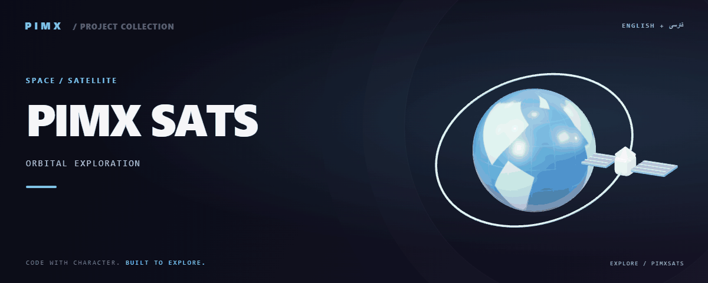

<div align="center">



**[English](README.md) · [فارسی](README.fa.md)**


</div>

# PIMX SATS

کاوشگر تعاملی ماهواره‌ها و منظومه شمسی؛ کره سه‌بعدی، محاسبه مدار با satellite.js و پیش‌بینی گذر ماهواره‌ها، داده‌های مداری را به یک محیط دیداری تبدیل می‌کنند.

[GitHub](https://github.com/MOHAMMADREZAABEDINPOOR/PIMXSATS) · [PIMX / Profile](https://github.com/MOHAMMADREZAABEDINPOOR) · [بنر ثابت](assets/readme/hero.png)

## امکانات

- زمین سه‌بعدی، ماهواره‌ها و مسیر حرکت روی سطح زمین
- موقعیت ناظر، گذر ماهواره از بالای سر و نمای آسمان
- علاقه‌مندی‌ها، مقایسه، تاریخچه مدار و پنل نزدیکی ماهواره‌ها
- نمای منظومه شمسی، هواشناسی فضایی و تبدیل مدار به صدا

## پشته فنی

| ابزار | نسخه یا منبع |
|---|---|
| React | `^19.2.1` |
| Next.js | `^15.4.9` |
| TypeScript | `5.9.3` |
| Three.js | `^0.185.1` |
| React Three Fiber | `^9.6.1` |
| Motion | `^12.23.24` |
| Tailwind CSS | `4.1.11` |

## شروع کار

Node.js 22.12 یا بالاتر و مدیر پکیج مشخص‌شده در package.json. نسخه وابستگی‌ها را مطابق فایل قفل نصب کنید.

```bash
git clone https://github.com/MOHAMMADREZAABEDINPOOR/PIMXSATS.git
cd PIMXSATS

npm ci
npm run dev
```

## تنظیمات

کلیدهای زیر از فایل نمونه یا کد استخراج شده‌اند؛ همه الزاماً اجباری نیستند. مقدار و پیش‌فرض را در همان فایل بررسی و اسرار را فقط در محیط محلی یا هاست تنظیم کنید.

| نام | کاربرد |
|---|---|
| `APP_URL` | تنظیم برنامه؛ تعریف را در منبع بررسی کنید |
| `GEMINI_API_KEY` | اعتبارنامه یا اتصال؛ خصوصی نگه دارید |

## استفاده

داشبورد را باز کنید، ماهواره را انتخاب و موقعیت ناظر را تنظیم کنید. بین کره زمین، آسمان و پنل گذرها جابه‌جا شوید. با `npm run snapshot` داده TLE همراه پروژه را تازه کنید.

## ساختار پروژه

| مسیر | نقش |
|---|---|
| [`app/`](app/) | مسیرها یا کد برنامه |
| [`assets/`](assets/) | فایل برند، رسانه و README |
| [`components/`](components/) | اجزای قابل استفاده مجدد رابط |
| [`lib/`](lib/) | ماژول‌های مشترک |
| [`public/`](public/) | فایل عمومی وب |
| [`scripts/`](scripts/) | ابزار توسعه و نگهداری |
| [`metadata.json`](metadata.json) | فایل ورودی یا تنظیم پروژه |
| [`package.json`](package.json) | فایل ورودی یا تنظیم پروژه |
| [`tsconfig.json`](tsconfig.json) | فایل ورودی یا تنظیم پروژه |

## فرمان‌ها و بررسی

```bash
npm run dev
npm run snapshot
npm run build
npm run start
npm run lint
npm run check:controls
```

این‌ها فرمان‌های موجود در package.json هستند؛ فهرست بالا گزارش اجرای آزمون نیست. فرمان تست ممکن است مرورگر، سرویس یا دیتابیس آماده بخواهد.

## استقرار

خروجی build را مطابق معماری منتشر کنید: پروژه دارای server به فرایند Node نیاز دارد؛ رابط Vite استاتیک می‌تواند از dist میزبانی شود. توابع Pages، KV یا D1 به تنظیم مستقل نیاز دارند.

## محدودیت‌ها

داده TLE با گذشت زمان قدیمی می‌شود و پیش‌بینی مدار تقریبی است. دریافت داده تازه به اینترنت نیاز دارد؛ موقعیت جغرافیایی اختیاری است. این پروژه برای کاوش آموزشی است.

## رفع مشکل

- پکیج غایب: وابستگی را با مدیر پکیج پروژه نصب کنید.
- خطای API یا شبکه: آدرس، سرویس و اتصال میزبانی را بررسی کنید.
- فایل قدیمی: در صورت وجود اسکریپت ساخت، build و کش مرورگر را تازه کنید.

## مشارکت

برای تغییر، شاخه مستقل بسازید، رفتار فعلی را بررسی کنید و توضیح روشن همراه تغییر بفرستید. اطلاعات خصوصی، خروجی build و دیتابیس محلی را commit نکنید.

## مجوز

فایل مجوز در این نسخه موجود نیست. نمایش عمومی کد به‌تنهایی مجوز استفاده مجدد نیست؛ برای شرایط استفاده با مالک مخزن هماهنگ کنید.

---

ساخته‌شده در مجموعه **PIMX** · مستندات فارسی و انگلیسی.
